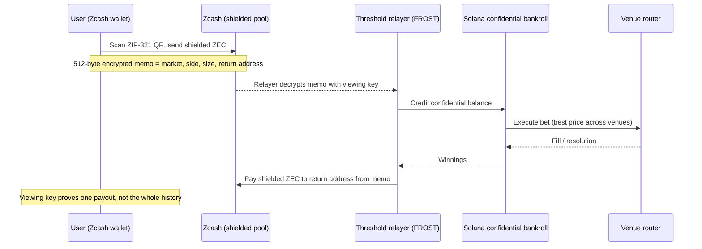

<div align="center">


<br />


### Bet on anything, on every market, from any chain, with a hidden bankroll and a loss limit you can't break.

A private, any-chain prediction-market terminal. Built for the Colosseum **Crypto World's Fair Hackathon**.

[Live demo](#) · [Demo video (90s)](#) · [Architecture](#architecture) · [Quickstart](#quickstart) · [What's real vs simulated](#whats-real-and-whats-simulated)

</div>

---

## TL;DR

- **Sign up with a fingerprint.** No seed phrase, no gas token, no chain to pick. _(Tempo passkeys + sponsored fees)_
- **Fund privately from anywhere.** Deposit from Base, Arbitrum, Ethereum or Solana, or send shielded Zcash where **the encrypted memo is the order**. _(Zcash)_
- **Hidden bankroll.** Your balance and transfer amounts are encrypted on Solana. The explorer only shows that an account exists. _(Solana Confidential Balances)_
- **Every venue on one screen.** Hyperliquid, Polymarket, Kalshi and Limitless prices for the same question side by side. A best-price router splits each bet across venues, fees included.
- **A loss limit nothing can break, including your AI agent.** _(Tempo MPP spend-limited sessions)_
- **Bet and hedge.** On macro/finance events, hedge in one tap with an index-ETF Stock Token on Robinhood Chain _(eligible regions only, testnet demo)_.
- **Get paid with receipts** you can prove or keep private. _(Tempo memos, Zcash viewing keys, Solana auditor keys)_

---

## The problem

Prediction markets are the hottest category in crypto, and they are broken in three ways:

| Problem        | What it looks like today                                                                                                            |
| -------------- | ----------------------------------------------------------------------------------------------------------------------------------- |
| **Public**     | Anyone can see your balance, your bets and your full wallet history.                                                                |
| **Annoying**   | You need a wallet, the right chain, the right gas token and a seed phrase before your first bet.                                    |
| **Fragmented** | The same question trades on several venues at different prices. You either pick one and overpay, or juggle accounts on every chain. |

## The solution

tyr is one app that fixes all three: a passkey account with no crypto setup, a bankroll that stays encrypted, and a router that finds the best price for every bet across every major venue.

An aggregator that routes across venues is a bigger market than a front end for one venue, it surfaces real cross-venue price gaps, and it earns a fee on every venue it routes to.

---

## Why each chain is here

Every chain does one job that only it can do. If a chain's job can't be shown clearly, it doesn't belong in the product.

| Chain                               | Job in tyr                                                                       | Why this chain                                                                                                                   |
| ----------------------------------- | -------------------------------------------------------------------------------- | -------------------------------------------------------------------------------------------------------------------------------- |
| **Tempo**                           | Home account: passkey login, gasless, spend limits, receipts, payouts, agent API | Native passkeys, sponsored fees, batching, spend-limited payment sessions (MPP) and transfer memos                               |
| **Zcash**                           | Private entry: a shielded payment with an encrypted memo _is_ the order          | The only chain with shielded transfers and a built-in encrypted message field                                                    |
| **Solana**                          | Confidential custody and settlement                                              | Confidential Balances hide balances and amounts natively                                                                         |
| **Hyperliquid**                     | Live execution venue, builder-code fee                                           | HIP-4 native outcome markets on one shared order book                                                                            |
| **Polymarket / Kalshi / Limitless** | More venues for the same questions                                               | Polymarket: deepest crypto-native volume. Kalshi: outcomes tokenized on Solana, next to the bankroll. Limitless: settles on Base |
| **Robinhood Chain**                 | "Bet and hedge" with index-ETF Stock Tokens; also a funding source               | 24/7 tokenized stocks with an official Chainlink price feed per token                                                            |
| **Base / Arbitrum / Ethereum**      | Deposit sources                                                                  | Users already hold funds there                                                                                                   |

---

## How it works

### Flow A: standard onboarding (any chain)

1. **Sign up** with Face ID / fingerprint. A Tempo passkey account is created; fees are sponsored. _(Tempo)_
2. **Set a loss limit**, e.g. $50/day. This opens a spend-limited session. _(Tempo MPP)_
3. **Fund** from Base, Arbitrum, Ethereum or Solana. The deposit lands in your confidential balance. _(→ Solana)_
4. **Browse** one list of questions across all venues, each showing every venue's price and the best YES/NO.
5. **Bet in one tap.** The router picks the best venue, or splits across several, by all-in price.
6. **Your bankroll stays hidden.** Amounts are encrypted on Solana.
7. **Get paid** in a stablecoin on Tempo with a memo-tagged receipt.
8. **Prove or hide** any payout, e.g. for taxes, without exposing your history.

### Flow B: the payment is the order (Zcash)



### Flow C: AI agent under a cap

1. The owner funds an agent and opens a **spend-limited session**. _(Tempo MPP)_
2. The agent trades through the tyr API and pays per call for market data and resolution evidence (HTTP 402). _(Tempo MPP)_
3. The agent **cannot** spend past the limit. The owner sees every receipt.

### Flow D: bet and hedge (Robinhood Chain)

Shown only in eligible regions. Demo runs on Robinhood Chain **testnet** with simulated Stock Tokens.

1. Open a macro/finance market, e.g. a Fed rate decision listed on Polymarket and Kalshi.
2. tyr offers a hedge: a matching index-ETF Stock Token (e.g. S&P-tracking).
3. One tap places the bet and swaps into the Stock Token through an open venue such as Uniswap.
4. The hedge price comes from the token's **Chainlink price feed**.
5. On resolution, payout and hedge P&L appear together in one receipt.

---

## Architecture

```
[User: passkey on Tempo]──limit session──►[App backend / API]
        ▲                                        │
        │ payouts + memo receipts                │ route orders (builder code)
        │                                        ▼
[Zcash shielded payment + memo]──►[FROST relayer]──►[Solana confidential bankroll]──►[Venue router]──►[Hyperliquid │ Polymarket │ Kalshi │ Limitless]
[Deposits from Base/Arb/ETH/SOL]─────────────────────────┘
[AI agent]──MPP session (capped)──►[App API: markets, data, orders]
[Macro/finance bet]──hedge leg──►[Robinhood Chain: Stock Token swap via Uniswap, Chainlink price feed]
```

### Components

| #   | Component                        | Responsibility                                                                         |
| --- | -------------------------------- | -------------------------------------------------------------------------------------- |
| 1   | **Frontend**                     | Mobile-first web app                                                                   |
| 2   | **Backend / API + order router** | Orders, routing, venue fan-out                                                         |
| 3   | **Account + limit service**      | Tempo passkey account, sponsored transactions, MPP spend-limited sessions              |
| 4   | **Zcash relayer**                | Viewing key, memo decoder, FROST threshold group, ZEC float                            |
| 5   | **Solana settlement**            | Anchor program + Token-2022 confidential mint                                          |
| 6   | **Venue layer**                  | One market model, one adapter per venue, cross-venue event matching, best-price router |
| 7   | **Funding router**               | Intents / bridge routes from Base, Arbitrum, Ethereum, Solana                          |
| 8   | **Receipts / proofs**            | Memo receipts, viewing-key and auditor-key disclosures                                 |
| 9   | **Agent API**                    | Market data and orders for capped agents, paid per call                                |
| 10  | **Hedge service**                | Robinhood Chain swap adapter (Uniswap), Chainlink price reader, geofence gate          |

### Cross-venue matching

Every market carries a canonical `eventKey`, so the same question lines up across venues. Hyperliquid price templates (`perp`, `threshold`, `time`) map to `price:<asset>:<threshold>:<time>`. The router then ranks legs by **all-in price**: venue price plus that venue's fees, for example Kalshi's `ceil(0.07 × contracts × P × (1 − P))`.

---

## What's real and what's simulated

We'd rather you hear it from us than find it in the code.

| Piece                                                       | Status                                                                                                                                                                                   |
| ----------------------------------------------------------- | ---------------------------------------------------------------------------------------------------------------------------------------------------------------------------------------- |
| Hyperliquid execution (HIP-4 outcome markets, builder code) | **Live**                                                                                                                                                                                 |
| Polymarket, Kalshi, Limitless                               | **Simulated adapters** behind the same interface: modeled books and fee schedules. Every fill is labeled `simulated: true`, on screen and in the API. Going live is writing one adapter. |
| Robinhood Chain hedge                                       | **Testnet**, simulated Stock Tokens                                                                                                                                                      |
| Tempo Zones                                                 | Stretch, availability unknown                                                                                                                                                            |
| Base / Arbitrum / Ethereum                                  | Deposit sources only                                                                                                                                                                     |

## What's private and what isn't

| Private                                                                   | Not private                                                                                                                        |
| ------------------------------------------------------------------------- | ---------------------------------------------------------------------------------------------------------------------------------- |
| Your bankroll balance and transfer amounts (Solana Confidential Balances) | That your account exists, its owner and the mint                                                                                   |
| The bet instruction inside a shielded Zcash memo                          | Positions once funds leave the confidential balance to trade: Hyperliquid, Polymarket and Limitless positions sit on public chains |
| Which payouts you disclose (you choose with viewing / auditor keys)       | The current intents routes exit Zcash through **transparent** addresses, so there is a visible hop                                 |

Privacy covers **custody and inbound funding**, not the trade on the venue itself.

## Trust model

- **Loss limits** are enforced by Tempo MPP spend-limited sessions, not by our backend. An agent or a compromised client cannot exceed them.
- **The Zcash relayer is a trust point**, even as a FROST threshold group where no single operator holds the money. We say so in the product.
- **Auditor key** (Solana) can decrypt transfer amounts, not balances. It is optional.
- **No seed phrases or private keys** are ever requested from the user.

---

## Business model

tyr earns a **routing fee on every venue** it sends volume to:

| Venue             | Mechanism                             |
| ----------------- | ------------------------------------- |
| Hyperliquid       | Builder-code fee on each routed trade |
| Polymarket        | Builder / attribution program         |
| Kalshi, Limitless | Referral / routing fees               |
| Agent API         | Premium per-call usage via MPP        |

Revenue scales with aggregated volume across venues, not with one venue's share of the market.

## Compliance and eligibility

- **Robinhood Stock Tokens** are not available in the US or to US persons, and are restricted in Canada, the UK, Switzerland, the UAE and sanctioned jurisdictions. The hedge feature is **geofenced and hidden** there. We do not help users get around geoblocks.
- **Each venue has its own rules.** Polymarket International blocks the US; Kalshi is CFTC-regulated, so tyr targets its **tokenized outcomes on Solana**, not pooled funds through its direct API. Venue access follows the user's region.
- **Resolution rules differ across venues.** Two venues can word the "same" question differently. Resolution rules must be compared before real money is routed across them.
- Betting regulation varies by jurisdiction. Tempo's TIP-403 policy registry can gate payouts.

---

## Demo (90 seconds)

1. Fingerprint sign-up → account exists, zero gas. _(Tempo)_
2. Set a $20/day limit.
3. Scan a QR, send shielded ZEC with a memo. Nothing about the bet is visible on-chain. _(Zcash)_
4. Solana explorer: the bankroll account exists, the amount is encrypted. _(Solana)_
5. Open a question listed on several venues. Prices side by side; the router splits the bet; the Hyperliquid leg shows the builder-code fee line.
6. Resolve a market. Payout arrives with a memo receipt. _(Tempo)_
7. Try to bet over the limit → **blocked**. _(Tempo)_
8. _(Optional, testnet)_ On a Fed-decision market, tap **Hedge** and show the Stock Token position and Chainlink price. _(Robinhood Chain)_

---

## Quickstart

> Fill in once the scripts are final.

```bash
git clone <repo-url> tyr
cd tyr
# install
# configure env (see below)
# run the web app
```

**Environment** _(placeholders; list real variable names here)_

- Tempo testnet ("Moderato") RPC and faucet
- Solana devnet RPC
- Hyperliquid API + builder code
- Zcash relayer viewing key (never commit it)
- Robinhood Chain testnet RPC

## Repo map

| Path              | What's inside                                                                 |
| ----------------- | ----------------------------------------------------------------------------- |
| `apps/web`        | Mobile-first web app (Next.js)                                                |
| `packages/venues` | Unified market model, venue adapters, cross-venue matching, best-price router |
| `docs/`           | Idea, PRD and research notes                                                  |

---

## Built with

- **Tempo**: passkey (WebAuthn) transactions, fee sponsorship, batching, TIP-20 memos, Machine Payments Protocol (MPP) sessions. [Docs](https://tempo.xyz/developers)
- **Zcash**: unified addresses, Orchard shielded pool, 512-byte encrypted memos, ZIP-321 payment requests, viewing keys, FROST threshold signing
- **Solana**: Token-2022 Confidential Balances, ZK ElGamal Proof Program, Anchor. [Privacy docs](https://solana.com/docs/finance/privacy)
- **Hyperliquid**: HIP-4 outcome markets, builder codes
- **Robinhood Chain**: Stock Tokens (ERC-20), Chainlink `AggregatorV3Interface` feeds, Uniswap. [Docs](https://docs.robinhood.com/chain/building-with-stock-tokens/)
- **Polymarket, Kalshi, Limitless**: simulated venue adapters

## Roadmap

- [x] Multi-venue layer: unified market model, simulated Polymarket / Kalshi / Limitless, cross-venue events, best-price router
- [ ] Core path: Tempo account → fund → Solana confidential balance → Hyperliquid bet → Tempo payout
- [ ] Zcash memo-as-order, capped agent sessions, receipts and proofs
- [ ] Robinhood Chain hedge (testnet)
- [ ] Deposit routes from Base / Arbitrum / Ethereum
- [ ] **Next:** make the first simulated venue live; route real money only after resolution rules match

## Open risks

1. Generating Confidential Balances proofs in the browser (SDK maturity and speed). **Highest risk.**
2. Zcash memo round trip in the relayer; FROST tooling; ZEC float for payouts.
3. A working Tempo ↔ Solana route.
4. Hyperliquid builder-code terms and which outcome markets are tradable via API.
5. Which Robinhood Chain testnet index-ETF tokens and pools exist.

---

## Open source

The funding router and the Zcash relayer are open source so any app can reuse private, any-chain entry into prediction markets.

## License

MIT _(confirm before submission)_

<div align="center">
<sub>Built for the Colosseum Crypto World's Fair Hackathon · MVP quality, testnet / devnet. Not audited.</sub>
</div>
