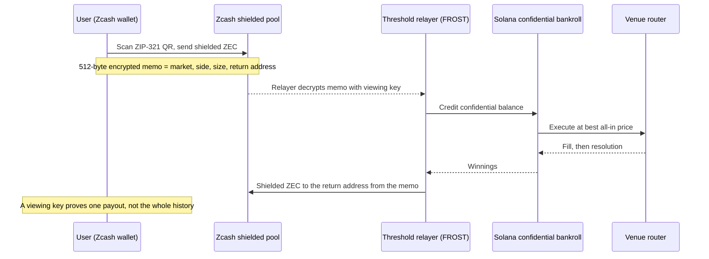

<div align="center">


<h1>tyr</h1>

<strong>The UX layer for all prediction markets.<br>Trade Polymarket, Kalshi and Hyperliquid from one account that hides your bankroll,<br>caps your losses on-chain, and lets an AI agent bet for you without ever going over.</strong>

[Live demo](#) · [Demo video (90s)](#) · [Pitch](#) · [X](#)

</div>

---

## What tyr is

Prediction markets became a $24B-a-month market. But the consumer UX still hasnt caught up.

Today:

- Every bet is a public record tied to your wallet.
- Every venue is a separate account on a separate chain.
- There's no real limit on what you can lose.
- Nothing stops an AI agent with your keys from spending everything.

### tyr is the account prediction markets were missing.

Think brokerage account, but for every prediction market at once.

**Touch your fingerprint → fund from any chain → trade Polymarket, Kalshi and Hyperliquid from one balance.**

And that balance can do three things no other account can:

> **No one sees your money.**
> Not your balance. Not your bet size. Not even on the block explorer.
>
> **Your limit is law.**
> Set it once and the chain enforces it. No "are you sure?" pop-up you can click through.
>
> **Your AI can trade, but it can't go rogue.**
> Hand an agent a budget, not your keys. It literally cannot spend a cent past your cap.

## Only on tyr

|                                           | What you get                                                                                                                                         | What makes it possible                                 |
| ----------------------------------------- | ---------------------------------------------------------------------------------------------------------------------------------------------------- | ------------------------------------------------------ |
| **A bet nobody can see**                  | Send shielded Zcash and the encrypted memo _is_ the order. Your bankroll lives in an encrypted balance; the explorer sees an account, not an amount. | Zcash shielded memos · Solana Confidential Balances    |
| **Limits the chain enforces**             | Set $50/day once. Every bet, from you or your agent, is checked against it on-chain. Over the limit is blocked, not warned.                          | Tempo spend-limited sessions (MPP)                     |
| **An agent with a budget, not your keys** | Give an AI a capped session. It trades and pays for its own data per call. You see every receipt.                                                    | Tempo MPP · HTTP 402                                   |
| **Bet and hedge in one tap**              | Betting on a Fed decision? Hedge it with an S&P Stock Token in the same ticket, with one combined receipt.                                           | Robinhood Chain Stock Tokens                           |
| **Proof without exposure**                | Prove one payout for taxes or a counterparty without revealing anything else.                                                                        | Zcash viewing keys · Solana auditor keys · Tempo memos |
| **Every market, best price**              | Polymarket, Kalshi, Hyperliquid and Limitless from one balance. Each bet goes where it's cheapest after fees.                                        | tyr router                                             |

No seed phrase. No gas. No chain picker. One fingerprint.

## Prediction markets are bigger than crypto

Prediction markets aren't a crypto niche. They're a mainstream financial market, and crypto questions are a small share of what trades.

|                                     | Data                                                                                                                                                                                  | Source                                                                                                                                                   |
| ----------------------------------- | ------------------------------------------------------------------------------------------------------------------------------------------------------------------------------------- | -------------------------------------------------------------------------------------------------------------------------------------------------------- |
| **Volume**                          | Combined monthly volume on Kalshi and Polymarket rose from **under $5B (Sept 2025) to about $24B (April 2026)**, roughly 5× in seven months.                                          | [Pew Research, May 2026](https://www.pewresearch.org/short-reads/2026/05/27/trading-volume-on-prediction-markets-has-soared-in-recent-months/)           |
| **Already bigger than sportsbooks** | That ~$24B a month is above the **~$14B a month** wagered through all legal US sportsbooks in 2025.                                                                                   | [Pew Research](https://www.pewresearch.org/short-reads/2026/05/27/trading-volume-on-prediction-markets-has-soared-in-recent-months/)                     |
| **Mostly not crypto**               | Crypto questions are just **7% of Kalshi volume** and **20% of Polymarket's**. Sports is 80% of Kalshi and 39% of Polymarket; politics is 32% of Polymarket (July 2024 – April 2026). | [Pew Research](https://www.pewresearch.org/short-reads/2026/05/27/trading-volume-on-prediction-markets-has-soared-in-recent-months/)                     |
| **Wall Street is in**               | NYSE owner **Intercontinental Exchange** agreed to invest up to **$2B in Polymarket** (Oct 2025) and distribute its data.                                                             | [Bloomberg Law](https://news.bloomberglaw.com/crypto/nyse-owner-to-invest-2-billion-in-betting-platform-polymarket)                                      |
| **Valued like exchanges**           | Kalshi raised at **$22B** (May 2026) from Coatue, Sequoia, a16z and Morgan Stanley, and is reported to be seeking **$40B**. Polymarket is valued at **$15B**.                         | [CoinDesk, June 2026](https://www.coindesk.com/business/2026/06/24/kalshi-targets-a-massive-usd40-billion-valuation-widening-lead-over-rival-polymarket) |

**What it means for tyr:** the people moving this volume are sports fans, politics watchers and macro traders, not crypto natives. They won't manage seed phrases or bridge between chains, and they don't want their bets public. tyr is built for them: one fingerprint, one private balance, and Polymarket and Kalshi, where this volume trades, on the same screen.

## Why now

Every piece tyr needs went live in the last six months:

|                                                                                    | Date            | Why it matters                                                                                        |
| ---------------------------------------------------------------------------------- | --------------- | ----------------------------------------------------------------------------------------------------- |
| **Hyperliquid HIP-4 outcome markets** on mainnet                                   | May 2, 2026     | Native outcome markets on one deep, shared order book that front ends can route to with builder codes |
| **Solana Confidential Transfers** back on mainnet after a year-long security pause | June 17, 2026   | Encrypted balances and amounts, natively, for the first time in a year                                |
| **Robinhood Chain** mainnet with Stock Tokens                                      | July 1, 2026    | 24/7 tokenized stocks with a Chainlink feed per token, so a bet can carry a real hedge                |
| **Tempo** mainnet with MPP (co-authored with Stripe)                               | 2026            | Passkeys, sponsored fees and spend-limited sessions as protocol features, not app logic               |
| **Solana Breakpoint 2026** headlines prediction markets and AI agents              | Nov 15–17, 2026 | The ecosystem is pushing both of tyr's users: retail bettors and agents                               |

---

## How it works

### Why each chain is here

Every chain does one job only it can do. If its job can't be shown clearly, it doesn't belong.

| Chain                               | Job in tyr                                                                       | Why this chain                                                                                                                   |
| ----------------------------------- | -------------------------------------------------------------------------------- | -------------------------------------------------------------------------------------------------------------------------------- |
| **Tempo**                           | Home account: passkey login, gasless, spend limits, receipts, payouts, agent API | Native passkeys, fee sponsorship, batching, spend-limited sessions (MPP), 32-byte transfer memos                                 |
| **Zcash**                           | Private entry: a shielded payment whose encrypted memo _is_ the order            | The only chain with shielded transfers plus a built-in encrypted message field                                                   |
| **Solana**                          | Confidential custody and settlement                                              | Confidential Balances hide balances and amounts natively                                                                         |
| **Hyperliquid**                     | Live execution venue, builder-code fee                                           | HIP-4 outcome markets on one shared order book                                                                                   |
| **Polymarket · Kalshi · Limitless** | More venues for the same questions                                               | Polymarket: deepest crypto-native volume. Kalshi: outcomes tokenized on Solana, next to the bankroll. Limitless: settles on Base |
| **Robinhood Chain**                 | Bet and hedge with index-ETF Stock Tokens; also a funding source                 | 24/7 Stock Tokens with a per-token Chainlink price feed                                                                          |
| **Base · Arbitrum · Ethereum**      | Deposit sources                                                                  | Users already hold funds there                                                                                                   |

### Flow A: standard onboarding

1. **Sign up** with Face ID or fingerprint. A Tempo passkey account is created; fees are sponsored.
2. **Set a loss limit**, e.g. $50/day. This opens a spend-limited MPP session.
3. **Fund** from Base, Arbitrum, Ethereum or Solana. Funds land in your confidential balance on Solana.
4. **Browse** one list of questions, each showing every venue's price and the best YES/NO.
5. **Bet in one tap.** The router picks the best venue or splits across several.
6. **Get paid** in a stablecoin on Tempo with a memo-tagged receipt.
7. **Prove or hide** a payout (e.g. for taxes) without exposing your history.

### Flow B: the payment is the order (Zcash)



### Flow C: an AI agent under a hard cap

1. The owner funds an agent and opens a **spend-limited session**.
2. The agent trades through the tyr API and pays per call for market data and resolution evidence over HTTP 402.
3. The agent **cannot** exceed the cap. The limit lives in the Tempo session, not in tyr's backend. The owner sees every receipt.

### Flow D: bet and hedge (Robinhood Chain)

Shown only in eligible regions. The demo uses Robinhood Chain testnet with simulated Stock Tokens.

1. Open a macro market, e.g. a Fed rate decision listed on Polymarket and Kalshi.
2. tyr offers a matching index-ETF Stock Token as a hedge.
3. One tap places the bet and swaps into the Stock Token through Uniswap.
4. The hedge price comes from the token's Chainlink feed (`AggregatorV3Interface`, 8 decimals).
5. On resolution, payout and hedge P&L land in one receipt.

---

## How the router picks a price

The router ranks venues by **all-in price**: the quoted price plus that venue's fee. The cheapest quote is not always the cheapest fill.

**Illustrative example:** buy 100 YES contracts on the same question.

| Venue      | Quote |                         Fee on 100 contracts |       All-in |
| ---------- | ----: | -------------------------------------------: | -----------: |
| Kalshi     | $0.60 | `ceil(0.07 × 100 × 0.60 × 0.40)` = **$1.68** |   **$61.68** |
| Polymarket | $0.61 |       $0.00 _(no taker fee on most markets)_ | **$61.00** ✓ |

Kalshi quotes lower, but Polymarket fills cheaper. When one venue's book can't fill the whole size at its best level, the router splits the order and fills each leg on whichever venue is cheapest for that slice.

### Matching the same question across venues

Each market carries a canonical `eventKey`, so equal questions line up even when venues word them differently. Hyperliquid price templates (`perp`, `threshold`, `time`) normalize to:

```
price:<asset>:<threshold>:<time>
```

Matching is curated, not fuzzy. Two venues can resolve the "same" question differently, so **resolution rules are compared before real money is routed across them.**

---

## Architecture

```
[User: passkey on Tempo]──limit session──►[App backend / API]
        ▲                                        │
        │ payouts + memo receipts                │ route orders (builder code)
        │                                        ▼
[Zcash shielded payment + memo]──►[FROST relayer]──►[Solana confidential bankroll]──►[Venue router]──►[Hyperliquid │ Polymarket │ Kalshi │ Limitless]
[Deposits from Base/Arb/ETH/SOL]─────────────────────────┘
[AI agent]──MPP session (capped)──►[App API: markets, data, orders]
[Macro/finance bet]──hedge leg──►[Robinhood Chain: Stock Token swap via Uniswap, Chainlink price feed]
```

| #   | Component                    | Responsibility                                                            |
| --- | ---------------------------- | ------------------------------------------------------------------------- |
| 1   | Frontend                     | Mobile-first web app                                                      |
| 2   | Backend / API + order router | Orders, all-in price ranking, venue fan-out                               |
| 3   | Account + limit service      | Tempo passkey account, sponsored transactions, MPP spend-limited sessions |
| 4   | Zcash relayer                | Viewing key, memo decoder, FROST threshold group, ZEC float               |
| 5   | Solana settlement            | Anchor program + Token-2022 confidential mint                             |
| 6   | Venue layer                  | One market model, one adapter per venue, cross-venue matching             |
| 7   | Funding router               | Intent / bridge routes from Base, Arbitrum, Ethereum, Solana              |
| 8   | Receipts / proofs            | Memo receipts, viewing-key and auditor-key disclosures                    |
| 9   | Agent API                    | Market data and orders for capped agents, paid per call                   |
| 10  | Hedge service                | Uniswap swap adapter, Chainlink price reader, geofence gate               |

---

## Business model

tyr takes a **routing fee on every venue** it sends volume to:

| Source             | Mechanism                             |
| ------------------ | ------------------------------------- |
| Hyperliquid        | Builder-code fee on each routed trade |
| Polymarket         | Builder / attribution program         |
| Kalshi · Limitless | Referral / routing fees               |
| Agent API          | Premium per-call usage via MPP        |

Revenue grows with **total volume across venues**, not with any one venue's share. Every new venue adapter adds both liquidity for users and a revenue line for tyr.

---

## Demo (90 seconds)

1. Fingerprint sign-up → account exists, zero gas. _(Tempo)_
2. Set a $20/day limit.
3. Scan a QR, send shielded ZEC with a memo. Nothing about the bet is visible on-chain. _(Zcash)_
4. Solana explorer: the bankroll account exists, the amount is encrypted. _(Solana)_
5. One question on several venues: prices side by side, the router splits the bet, the Hyperliquid leg shows the builder-code fee line.
6. Resolve a market; the payout arrives with a memo receipt. _(Tempo)_
7. Bet over the limit → **blocked**. _(Tempo)_
8. _(Testnet)_ On a Fed-decision market, tap **Hedge**: Stock Token position and Chainlink price. _(Robinhood Chain)_

---

## Quickstart

> Fill in once scripts are final. Aim for one command, like `docker compose up` or `pnpm dev`.

```bash
git clone <repo-url> tyr && cd tyr
pnpm install
cp .env.example .env    # see below
pnpm dev                # web app on http://localhost:3000
```

| Variable                   | Purpose                                    |
| -------------------------- | ------------------------------------------ |
| `TEMPO_RPC_URL`            | Tempo testnet ("Moderato"); faucet is free |
| `SOLANA_RPC_URL`           | Solana devnet                              |
| `HYPERLIQUID_BUILDER_CODE` | Builder-code fee on routed trades          |
| `ZCASH_VIEWING_KEY`        | Relayer memo decryption. **Never commit.** |
| `ROBINHOOD_CHAIN_RPC_URL`  | Robinhood Chain testnet                    |

_(Variable names are placeholders; replace them with the real ones.)_

### Tests

```bash
pnpm test           # unit
pnpm test:e2e       # Playwright (apps/web/e2e)
```

## Repo map

```
tyr/
├── apps/
│   └── web/                # Next.js frontend, Playwright e2e
├── services/
│   ├── api/                # Fastify REST + WebSocket API, auth, orchestration (OpenAPI spec)
│   ├── workers/            # BullMQ workers: deposits, Zcash scanner, settlement, payouts
│   ├── frost-signer/       # Rust FROST threshold signer for the Zcash relayer
│   └── zcash-sidecar/      # Rust Zcash sidecar
├── packages/
│   ├── core/               # Shared types, zod schemas, config, testnet guard
│   ├── api-client/         # Typed client for the tyr API
│   ├── db/                 # Prisma schema and database client
│   ├── pipeline/           # Bet pipeline: limit → bankroll → venue → settlement
│   ├── venues/             # Market model, venue adapters, cross-venue matching, router
│   ├── hyperliquid/        # Hyperliquid trading adapter (signing, builder code)
│   ├── tempo/              # Tempo accounts, spend-limited sessions, memo payouts
│   ├── solana/             # Token-2022 confidential balances + Anchor client
│   ├── zcash/              # Memo codec, ZIP-321 payment requests, FROST coordinator
│   ├── robinhood/          # Stock Token hedge, price reader, geofence
│   ├── evm-deposits/       # Base / Arbitrum / Ethereum deposit watchers
│   └── receipts/           # Receipts and proofs
├── programs/
│   └── tyr_settlement/     # Anchor settlement program (Solana)
├── infra/                  # Docker Compose: Postgres, Redis, Zcash regtest, FROST
├── examples/
│   └── agent.ts            # AI agent trading under a capped session
├── scripts/                # Wallet generation, funding and setup scripts
├── spikes/                 # Early chain spikes (Solana, Zcash, Tempo, Hyperliquid, Robinhood)
├── brand-assets/           # Logo, banner, style
└── docs/                   # Idea, PRD, research, test evidence
```

---

## Built with

[Tempo](https://tempo.xyz/developers) · Zcash (Orchard, ZIP-321, FROST) · [Solana Confidential Balances](https://solana.com/docs/finance/privacy) · Anchor · Hyperliquid HIP-4 · [Robinhood Chain Stock Tokens](https://docs.robinhood.com/chain/building-with-stock-tokens/) · Chainlink · Uniswap · Next.js

## Contributing and security

Issues and PRs are welcome. To report a vulnerability, please **don't open a public issue**: contact the team directly _(add a contact)_.

## License

MIT _(confirm before submission)_

<div align="center">
<br />
<sub>Built for the Colosseum Crypto World's Fair Hackathon · testnet / devnet · not audited</sub>
</div>
